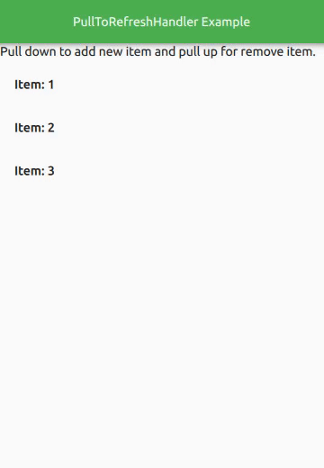

# PullToRefreshHandler
This QML component implements pull-to-refresh feature.

## Examples:
  

## Install:
Add the `PullToRefreshHandler.pri` to your project file (`.pro`), like the following:
```
include(Path/to/PullToRefreshHandler.pri)
```

## Usage:
Put the `PullToRefreshHandler` component on the flickable element (e.g ListView):

```
    ListView
    {
        delegate: ItemDelegate
        {
            text: model.text
            width: parent.width
        }

        PullToRefreshHandler
        {
            onPulldownrelease:
            {
                // Add your handling code here:
            }

            onPulluprelease:
            {
                // Add your handling code here:
            }
        }
    }
```

### Signals:
+ signal `pulldown()`
+ signal `pullup()`
+ signal `pulldownrelease()`
+ signal `pulluprelease()`

### Properties:
+ `flickable`: var => Target flickable element, default is set to parent
+ `threshold`: int => The threshold of distance changes in the percentage of the parent height
+ `is_pulldown` (Readonly): bool
+ `is_pullup` (Readonly): bool 
+ `swipe_up_hint_delegate`: Component => Any QML visual item to show when the flickable is scrolled to the end.
+ `swipe_down_hint_delegate`: Component => Any QML visual item to show when the flickable is scrolled to the beginning.
+ `refresh_indicator_delegate`: Component => Any QML Visual item to show when the flickable is scrolled to down or up, if you do not set this delegate, the default refresh indicator will show.
+ `indicator_drag_direction`: IndicatorDragDirection enum => `indicator_drag_direction` will specify when the `refresh_indicator` must be shown, the default value is `TOPTOBOTTOM`.


## Custom Refresh Indicator:
Any QML visual element can use as the refresh indicator, so you can easily create your custom refresh indicator.
When you set `refresh_indicator_delegate` to your custom refresh indicator, `PullToRefreshHandler` will expose the `handler_progress` variable to your component so you can represent the progress using the value of the `handler_progress`.

a simple example:
```
PullToRefreshHandler
{
    id: pulldown_handler
    threshold: 20
    refresh_indicator_delegate: Rectangle {
        x: (pulldown_handler.width - width) / 2
        color: Qt.rgba(255 , 0, 0, (handler_progress / 100))
        width: 24
        height: 24
        radius: width / 2
    }
}
```
For more complex implementation, please read the `RefreshIndicator.qml`.

## Notes:
If you want to disable the refresh indicator you must change `refresh_indicator.active` to the false.